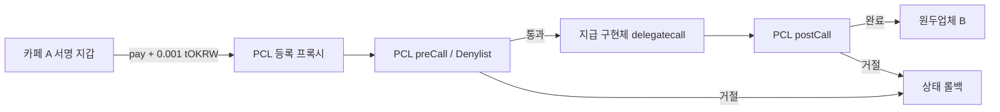
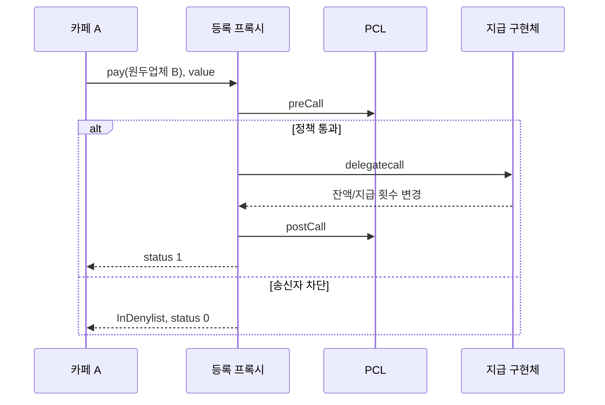

# 아키텍처와 검증 경계

## PCL · Live Testnet

이번 Denylist는 송신자를 검사합니다. 수취 기업 심사나 사기 자동 탐지는 구현하지 않았습니다. 정책 관리자와 지급 owner는 실습에서 같은 지갑입니다. 운영에서는 역할 분리·권한 변경·감사 로그가 필요합니다. PCL은 실제 은행 심사를 대체하지 않습니다.

## Privacy · Local

Alice=카페 A, Bob=원두업체 B. 공개 예치로 note를 만들고, 로컬 prover가 witness로 proof를 생성합니다. 로컬 체인은 proof를 검증하고 상태를 갱신하며 Bob은 자신의 키로 note를 조회합니다. 검증 결과는 예치 10→지급 7→Alice 3/Bob 7입니다.

| 경계 | 책임·공개 범위 | 검증 |
|---|---|---|
| 공개 RPC/체인 | 트랜잭션·이벤트·공개 예치 정보 | 모든 단계가 비공개라고 주장하지 않음 |
| 지갑 | 서명키·수신/조회용 비밀 관리 | 로컬 note 조회 확인 |
| prover | witness 처리 | 개발용 로컬 prover 사용; 원격 위탁 미검증 |
| auditor | 감사키·disclosure 접근 통제 | 구성은 존재하지만 감사자 복호화 미검증 |
| 정책 관리자 | 정책 변경과 중지 책임 | 테스트넷 Denylist 변경 확인 |

## Maroo valid Privacy로 넘어가는 경계

최초 차단은 **유효 payload 준비 단계**입니다. 현재 Maroo verifier에 대응하는 circuit pin·proving artifact, 공개 privacy state/Merkle witness 조회, proof serialization/known-good fixture의 연결을 확보하지 못했습니다. 자료가 존재하지 않는다고 단정하는 것이 아니라 이번 조사에서 재현 가능한 조합을 확보하지 못했다는 뜻입니다.

임의 invalid proof는 보내지 않았습니다. [공개 인터페이스 조회](../evidence/live-testnet/PRIVACY_PUBLIC_PROBE.json)는 상태 변경이나 유효 proof 능력의 증거가 아닙니다. Clairveil 로컬 proof도 Maroo 호환성을 입증하지 않습니다. 운영 적용 전에는 위 선행 자료, 키 custody, 감사 권한, 중복 지급 방지와 장애 복구를 별도로 검증해야 합니다.

Clairveil SHA: `af04cfc994a3da87a8b1b902eda0988feb512539`. 외부 Maroo 주소·ABI는 [Maroo Docs](https://docs.maroo.io), 구현 참고는 [Clairveil](https://github.com/DELIGHT-LABS/clairveil/tree/af04cfc994a3da87a8b1b902eda0988feb512539)를 사용합니다.
