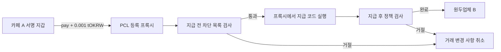
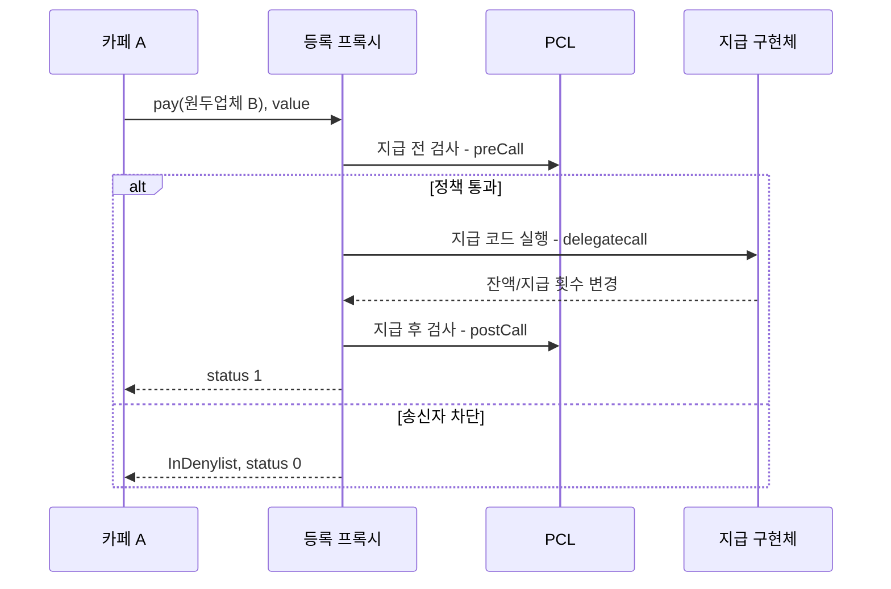

# 구조와 확인한 범위

## PCL · 실제 테스트넷 실행

이번 차단 목록(Denylist)은 송신자를 검사합니다. 수취 기업 심사나 사기 자동 탐지는 구현하지 않았습니다. 정책 관리자와 지급 권한을 가진 계정(owner)는 실습에서 같은 지갑입니다. 운영에서는 역할 분리·권한 변경·감사 로그가 필요합니다. PCL은 실제 은행 심사를 대체하지 않습니다.

## Privacy · Local

Alice는 카페 A, Bob은 원두업체 B입니다. 먼저 공개적으로 예치해 비공개 잔액 기록(note)을 만듭니다. 내 컴퓨터의 증명 생성 프로그램은 잔액과 소유권 등의 데이터를 사용해 지급이 유효하다는 증명(proof)을 만듭니다. 로컬 체인이 이를 확인하면 지급이 반영되고, Bob은 자신의 키로 받은 잔액을 조회합니다. 예치 10 → 지급 7 → Alice 3 / Bob 7을 확인했습니다.

| 경계 | 책임·공개 범위 | 검증 |
|---|---|---|
| 공개 RPC/체인 | 거래·이벤트·공개 예치 정보 | 모든 단계가 비공개라고 주장하지 않음 |
| 지갑 | 서명키·수신/조회용 비밀 관리 | 내 컴퓨터에서 비공개 잔액 조회 확인 |
| 증명 생성 프로그램 | 비공개 입력 데이터 처리 | 내 컴퓨터에서 증명 생성; 외부 서버 위탁은 미검증 |
| 감사자 | 감사용 키와 거래 정보 열람 권한 관리 | 구성은 존재하지만 감사자의 거래 정보 열람 미검증 |
| 정책 관리자 | 정책 변경과 중지 책임 | 테스트넷 Denylist 변경 확인 |

## Policy·Privacy·Disclosure의 상태와 권한

| 역할 | 살펴볼 상태 | 누가 무엇을 책임지는가 |
|---|---|---|
| Policy | 차단 목록, 적용 함수, 정책 관리자 | 관리자는 업무 판단을 정책에 반영하고, 체인은 설정한 조건을 검사합니다. 정책이 은행 심사 자체를 대신하지는 않습니다. |
| Privacy | 비공개 잔액 기록, 사용한 기록, 증명 검증 결과 | 지갑과 증명 생성 프로그램은 비공개 입력과 키를 다룹니다. 체인은 증명을 검증합니다. |
| Disclosure | 공개할 거래·정보 범위, 열람 권한 | 어떤 정보를 누구에게 공개할지 별도로 정해야 합니다. 지급 권한이 있다고 다른 사람의 거래까지 열람할 수 있는 것은 아닙니다. |

수취인이 자기 잔액을 조회하는 것과 감사자가 타인의 거래 정보를 열람하는 것은 다릅니다. 이번 실습은 전자를 확인했으며, 후자의 권한 통제와 실제 열람은 검증하지 않았습니다.

## 문서에 설명된 PCL–Privacy 연결과 실습 범위

[공식 Privacy 문서](https://docs.maroo.io/concepts/privacy)는 Privacy 프리컴파일이 상태 변경 요청을 처리할 때 자체 진입점에서 PCL 정책을 평가한다고 설명합니다. 이는 지급 컨트랙트를 PCL 등록 프록시로 감싸는 이번 실습 경로와 다릅니다. 따라서 Privacy를 같은 프록시에 단순히 연결하면 된다고 설명하지 않습니다.

이 구조는 **문서에서 확인한 내용**입니다. 정상 Privacy 거래를 테스트넷에 보내 정책 위반 시 지급이 차단되는지 직접 실행한 것은 아닙니다. 제품의 연결 기능이 없거나 향후 개발 예정이라는 뜻도 아닙니다.

## Maroo 테스트넷의 정상 비공개 지급에 더 필요한 준비

**Maroo 테스트넷에 보낼 정상적인 거래 입력을 준비하는 단계에서 멈췄습니다.** 체인의 검증 방식에 맞는 증명 생성 파일, 증명에 넣을 데이터, 전송 형식을 함께 확인해야 합니다. 이번 조사에서는 이들을 연결해 실행하는 방법을 확보하지 못했습니다. 필요한 자료가 없거나 기능이 작동하지 않는다는 뜻은 아닙니다.

임의로 만든 잘못된 증명은 보내지 않았습니다. [공개 인터페이스 조회](../evidence/live-testnet/PRIVACY_PUBLIC_PROBE.json)는 실제 지급이 이루어졌다는 증거는 아닙니다. 내 컴퓨터의 Clairveil에서 만든 증명이 Maroo에서도 통한다는 뜻은 아닙니다. 운영 적용 전에는 위 선행 자료, 키 보관·관리, 감사 권한, 중복 지급 방지와 장애 복구를 별도로 검증해야 합니다.

Clairveil SHA: `af04cfc994a3da87a8b1b902eda0988feb512539`. 외부 Maroo 주소·ABI는 [Maroo Docs](https://docs.maroo.io), 구현 참고는 [Clairveil](https://github.com/DELIGHT-LABS/clairveil/tree/af04cfc994a3da87a8b1b902eda0988feb512539)를 사용합니다.
